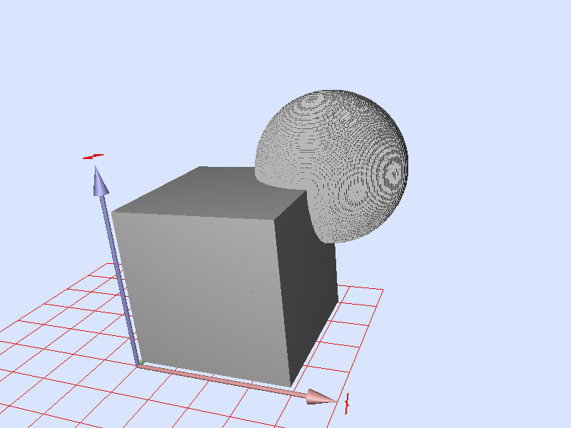

# VolGallery


A gallery of volumetric images and objects (only binary objects at
this point). All objects are given for
various grid resolutions (from 64^3 to 1024^3). The file format is the VOL one ("Version 3",
ASCII header and a zlib compressed unsigned char map). In the
[tools](https://github.com/dcoeurjo/VolGallery/tree/master/tools),
various tools and converter on this format are given.

Other  VOL files are available on the [IAPR TC-18](http://tc18.org) website.


Object name | Input | Snapshot
----------- | ----- | --------
[Spot](https://github.com/dcoeurjo/VolGallery/tree/master/Spot) | [OBJ](https://github.com/dcoeurjo/VolGallery/tree/master/Spot/spot.obj) | 
[Lucy](https://github.com/dcoeurjo/VolGallery/tree/master/Lucy) | [STL](https://github.com/dcoeurjo/VolGallery/tree/master/Lucy/lucy.stl) | 
[Horse](https://github.com/dcoeurjo/VolGallery/tree/master/Horse) | [OBJ](https://github.com/dcoeurjo/VolGallery/tree/master/Horse/horse.obj) | 
[WDAS-Cloud](https://github.com/dcoeurjo/VolGallery/tree/master/WDAS-Cloud) | Walt Disney Animation Studio | 
[Fertility](https://github.com/dcoeurjo/VolGallery/tree/master/Fertility) | AIM@shape | 
[Filigree](https://github.com/dcoeurjo/VolGallery/tree/master/Filigree) | AIM@shape | 
[Chinese-dragon](https://github.com/dcoeurjo/VolGallery/tree/master/Chinese-dragon) | [STL](https://github.com/dcoeurjo/VolGallery/tree/master/Chinese-dragon/dragon.stl) | 
[Fandisk](https://github.com/dcoeurjo/VolGallery/tree/master/Fandisk) | [STL](https://github.com/dcoeurjo/VolGallery/tree/master/Fandisk/fandisk.stl) | 
[Hairball](https://github.com/dcoeurjo/VolGallery/tree/master/Hairball) | [STL](https://github.com/dcoeurjo/VolGallery/tree/master/Hairball/hairball.obj.gz) | 
[Happy-Buddha](https://github.com/dcoeurjo/VolGallery/tree/master/Happy-Buddha) | [STL](https://github.com/dcoeurjo/VolGallery/tree/master/Happy-Buddha/buddha.stl) | 
[Octaflower](https://github.com/dcoeurjo/VolGallery/tree/master/Octaflower) | [STL](https://github.com/dcoeurjo/VolGallery/tree/master/Octaflower/octa-flower17k.stl) | 
[Sharpsphere](https://github.com/dcoeurjo/VolGallery/tree/master/Sharpsphere) |  | 
[Stanford-bunny](https://github.com/dcoeurjo/VolGallery/tree/master/Stanford-bunny) |  | 
[XYZRGB-dragon](https://github.com/dcoeurjo/VolGallery/tree/master/XYZRGB-dragon) |  | 
[Cube-Sphere](https://github.com/dcoeurjo/VolGallery/tree/master/CubeSphere) | [STL](https://github.com/dcoeurjo/VolGallery/tree/master/CubeSphere/cubesphere.stl) | 
[Torus-knot](https://github.com/dcoeurjo/VolGallery/tree/master/Torus-knot) | [STL](https://github.com/dcoeurjo/VolGallery/tree/master/Torus-knot/Torus_Knot.STL) | 
[Mathematical Shapes](https://github.com/dcoeurjo/VolGallery/tree/master/Shapes)  [volgen](http://liris.cnrs.fr/%7Edcoeurjo/Code/SimpleVol/Volgen/) | |

## AUTHORS

* [David Coeurjolly](http://liris.cnrs.fr/david.coeurjolly) ([@dcoeurjo](https://github.com/dcoeurjo)), LIRIS - CNRS, France
* [Jérémy Levallois](http://liris.cnrs.fr/jeremy.levallois) ([@jlevallois](https://github.com/jlevallois)), LIRIS - CNRS, France


## License & Disclaimer

For each geometrical object, I have tried to specify the associated
copyrights if applicable. For instance, the STL mesh file used to
generate the volumetric Stanford Bunny objects belongs to Stanford
University (see for instance
[Stanford Bunny](https://github.com/dcoeurjo/VolGallery/tree/master/Stanford-bunny/)). In
case some references are wrong and should be adjusted, please do not
hesitate to send me an e-Mail.


Beside copyrights associated with some STL mesh files, all volumetric
objects are distributed using the BY-NC-ND Creative Commons Licence <a
rel="license"
href="http://creativecommons.org/licenses/by-nc-nd/2.0/fr/deed.en"></a><br /> <a rel="license"
href="http://creativecommons.org/licenses/by-nc-nd/2.0/fr/deed.en">Creative
Commons Attribution-NonCommercial-NoDerivs 2.0 France License</a>.

If you want to use or distribute derivatives of this work for your own
purposes, contact the author.

If you use digital objects from this repository, it would be great if
you could "star" this project on GitHub or notify me.

## Misc

### Rasterizer

To generate the digital objects  from a STL mesh file, I have used the
[binvox](http://www.cs.princeton.edu/~min/binvox/) rasterizer or the mesh rasterizer
given in [DGtal](https://dgtal.org) (see DGtalTools). Once
the boundary has been obtained, a simple interior filling process is
applied to fill up the objects.

In the [tools](https://github.com/dcoeurjo/VolGallery/tree/master/tools) folder, I've added
the shell script that I use to generate the vol files from an OFF gemetry using [DGtal](dgtal.org) tools.


### Snapshots

The snapshots have been obtained using the
[DGtalTools](https://github.com/DGtal-team/DGtalTools) tool ```3dVolBoundaryViewer```.
